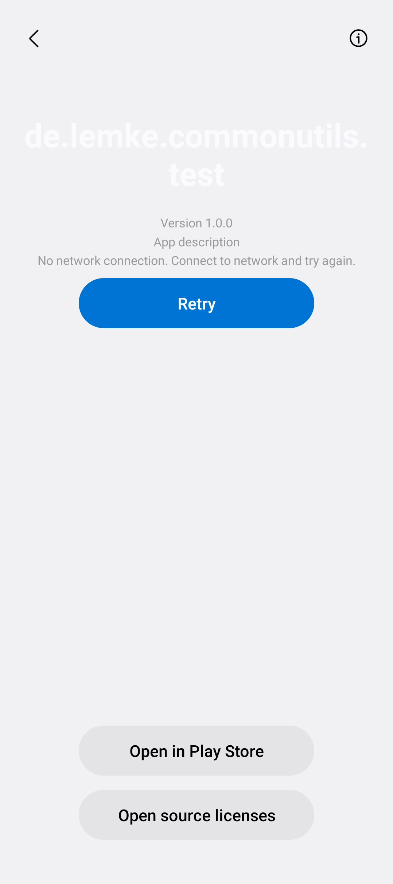
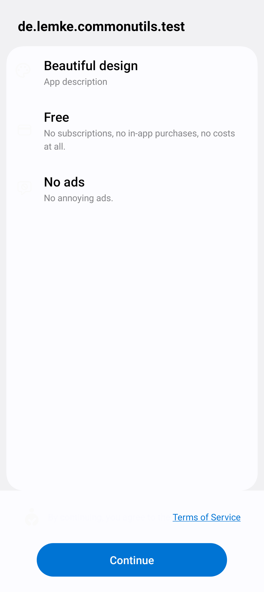
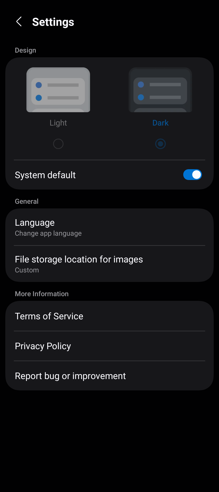

<!--suppress HtmlDeprecatedAttribute CheckImageSize-->
<div align="center">

[](https://www.leonard-lemke.com/rr)
[](https://opensource.org/licenses/Apache-2.0)
[](https://android-arsenal.com/api?level=26)
[](https://kotlinlang.org/)

[](https://github.com/Lemkinator/common-utils/commits/)
[](https://github.com/Lemkinator/common-utils/issues)
[](https://github.com/Lemkinator/common-utils/pulls)
[](https://github.com/Lemkinator/common-utils/graphs/contributors)

[](https://github.com/Lemkinator/common-utils)
[](https://github.com/Lemkinator/common-utils)
[](https://www.codefactor.io/repository/github/lemkinator/common-utils/overview/main)
[](https://codecov.io/gh/Lemkinator/common-utils)

# Common utils

This lib consists of common utils that I use in my Android Apps.







<br><br>

## Settings migration

`migrateSettings` moves settings that older app versions stored elsewhere into the app's settings store.
Call it once at app start, before anything reads settings.
The Hilt provider of the app's settings is the natural place:

```kotlin
@Provides
@Singleton
fun provideUserSettings(@ApplicationContext context: Context): UserSettings =
    UserSettings(
        PreferenceManager.getDefaultSharedPreferences(context).migrateSettings(context) {
            dataStore("userSettings") {
                keys("iconSize", "maskEnabled")
                key("textsize", to = "textSize")
                key("errorLimit") { it.toString() }
            }
            sharedPreferences("legacyPrefs") { keys("lastSync") }
            renames { key("pdf_page_snap_pref", to = "pdfPageSnap") }
        },
    )
```

- `dataStore(name)` reads `files/datastore/<name>.preferences_pb` directly, without a DataStore instance.
- `sharedPreferences(name)` reads another SharedPreferences file.
- `renames` moves keys to new names inside the target store.
  Its `key(from, to, convert)` requires a `to` that differs from `from`, and it offers no `keys()`.
- `key(from, to, convert)` maps one key. `convert` returns a Boolean, Int, Long, Float, String or `Set<String>`, or null to drop the value.
- If `convert` throws, the call logs the exception and drops the value. It still removes the source, so startup continues.
- A key that already exists in the target stays untouched. Among the sources, the first declared one wins.
- The call commits the target before it returns. Only then does it remove each source, so a second call finds nothing to move.
- A missing source is a no-op. A corrupt DataStore file stays on disk, and startup continues.
- Every call also moves the library's own `lastInAppReview` out of its former `InAppReviewUtils` file.
  Call `migrateSettings(context)` even when the app has nothing else to move.
- The app must stop opening a migrated DataStore file, since the call deletes it.

<br><br>

## Apps using Common utils

<div>
  <a href="https://github.com/Lemkinator/oneurl"></a>
  <a href="https://github.com/Lemkinator/sudoku"></a>
  <a href="https://github.com/Lemkinator/geticon"></a>
</div>

<br><br>

## Stats


<br>

## Code Coverage

[](https://codecov.io/gh/Lemkinator/common-utils)

<br>

<a href="https://www.star-history.com/?repos=Lemkinator%2Fcommon-utils&type=date&legend=top-left">
 <picture>
   <source media="(prefers-color-scheme: dark)" srcset="https://api.star-history.com/chart?repos=Lemkinator/common-utils&type=date&theme=dark&legend=top-left" />
   <source media="(prefers-color-scheme: light)" srcset="https://api.star-history.com/chart?repos=Lemkinator/common-utils&type=date&legend=top-left" />
   
 </picture>
</a>

</div>
